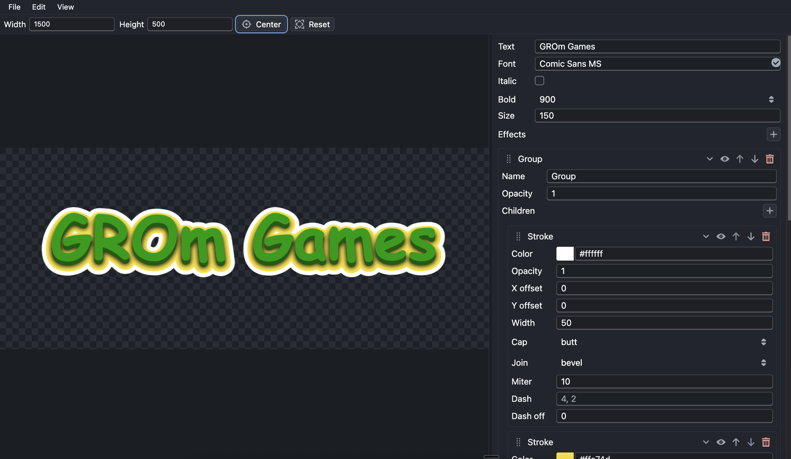

# Text Effects Editor

Text Effects Editor is a browser-based editor for designing styled text and exporting it as a transparent PNG. It is useful for game UI labels, thumbnails, stream overlays, banners, stickers, and quick typography experiments where layered text effects are easier than working in a full graphics editor.

The app uses a canvas preview with a tree of effects. Effects can be grouped, reordered, disabled, and saved as JSON presets.



## Developer And Support

Text Effects Editor is developed by Roman Gaikov.

- Website: [grom-games.com](https://grom-games.com)
- Donations: [PayPal: grom.games@gmail.com](https://www.paypal.com/donate/?business=grom.games%40gmail.com&currency_code=USD)

## Features

- Live text preview on a transparent checkerboard canvas.
- Editable text, font family, italic flag, font weight, font size, and canvas size.
- Layered effects with drag-and-drop ordering and nested groups.
- Undo/redo for property edits and effect tree changes.
- Save settings to browser local storage.
- Import/export JSON presets.
- Export the current result as a PNG file.
- Copy the current transparent PNG image to the system clipboard.
- Save reusable effect stacks in local and Cloudflare-backed global galleries.
- Pan, zoom, center view, reset zoom, and resizable properties panel.
- Two-row top bar with a hover menu and compact canvas toolbar.
- Light or dark checkerboard preview background stored as an app preference.

## Getting Started

```bash
npm install
npm run dev
```

Open `http://localhost:3001`.

For a production build:

```bash
npm run build
```

The build output is written to `dist/`.

## Basic Workflow

1. Set the canvas `Width` and `Height` in the top bar.
2. Edit the text, font, style, and size in the right properties panel.
3. Use the Effects section to add `Fill`, `Stroke`, `Gradient Fill`, `Shadow`, `Glow`, or `Group`.
4. Drag effects by the handle to change their order or move them into groups.
5. Toggle the eye icon to temporarily hide an effect.
6. Use `File -> New` to reset the current document and clear undo/redo history.
7. Use `File -> Save Settings` to store the current setup in this browser.
8. Use `File -> Export JSON` to save a reusable preset, or `File -> Export PNG` to save the rendered image.
9. Use `File -> Copy to Clipboard` to copy the current transparent PNG without saving a file.
10. Use `Gallery -> Add To Local Gallery` to save a private effect stack in this browser.
11. Use `Gallery -> Show Local Gallery` or `Gallery -> Show Global Gallery` to search and apply saved stacks.
12. Use `Account -> Sign in` to register with OAuth, view account email/role, or sign out.
13. Use `Gallery -> Add To Global Gallery` to submit an effect stack for moderation after signing in.
14. Use `View -> Checkerboard` to switch between light and dark transparency backgrounds.
15. Use `Edit` and `View` menu commands, or the matching shortcuts, for undo/redo and canvas navigation.

## Effect Model

Effects render in order. A `Group` renders its child effects into an isolated buffer, then draws that buffer into its parent. Buffer effects such as `Shadow` and `Glow` transform whatever has already been drawn inside their current group, then put the original content back on top. This means order matters:

- `Fill -> Shadow` casts a shadow from the fill.
- `Shadow -> Fill` has no visible shadow because there is no previous content yet.
- `Fill -> Group(Stroke -> Glow)` applies the glow only to the grouped stroke.

Every effect has:

- `Visible`: enables or disables rendering without deleting the effect.
- `Opacity`: alpha from `0` to `1`, where `0` is transparent and `1` is fully opaque.
- `Collapsed`: UI-only state for hiding or showing the effect properties.

## Effects And Parameters

### Group

Groups collect child effects and render them as a unit.

- `Name`: label shown in the effect tree.
- `Opacity`: opacity of the entire rendered group.
- `Children`: nested effects, including other groups.

Use groups to isolate an effect chain, apply shadow/glow only to part of the stack, or keep a complex preset organized.

### Fill

Draws filled text.

- `Color`: fill color.
- `Opacity`: fill transparency.
- `X offset`, `Y offset`: shifts the filled text relative to the main text position.

Use Fill as the base visible text layer.

### Stroke

Draws an outline around the text.

- `Color`: stroke color.
- `Opacity`: stroke transparency.
- `X offset`, `Y offset`: shifts the outline.
- `Line width`: outline thickness in pixels.
- `Line cap`: end style for dashed stroke segments: `butt`, `round`, or `square`.
- `Line join`: corner style where stroke segments meet: `miter`, `round`, or `bevel`.
- `Miter`: maximum sharp-corner extension for `miter` joins.
- `Dash`: comma-separated dash pattern, for example `8, 4`.
- `Dash offset`: shifts the dash pattern along the outline.

Use Stroke for readable outlines, sticker-style borders, or dashed decorative edges.

### Gradient Fill

Draws filled text using a gradient that automatically spans the text bounds.

- `Colors`: one or more color stops. Stops are distributed evenly.
- `Opacity`: gradient transparency.
- `X offset`, `Y offset`: shifts the gradient-filled text.
- `Direction`: `horizontal` or `vertical`.

Use Gradient Fill for colorful titles without manually setting gradient coordinates.

### Shadow

Creates a shadow from the current buffer, draws it behind the existing content, then redraws the original content above it.

- `Color`: shadow color.
- `Opacity`: shadow transparency.
- `X offset`, `Y offset`: additional shadow shift.
- `Blur`: blur radius in pixels.
- `Shadow X`, `Shadow Y`: main shadow offset in pixels.

Use Shadow after one or more visible effects. Put effects in a group when only that group should cast the shadow.

### Glow

Creates a colored blurred halo from the current buffer, draws it behind the existing content, then redraws the original content above it.

- `Color`: glow color.
- `Opacity`: glow transparency.
- `Blur`: glow softness in pixels.
- `Spread`: glow strength, repeated from `1` to `8`.

Use Glow after a fill, stroke, or gradient layer to create neon, magic, or selection-highlight effects.

## Saving And Export

- `New`: resets text, font settings, canvas size, effects, and undo/redo history.
- `Save Settings`: writes the current editor state to local storage and restores it on the next app start.
- `Import JSON`: loads a previously exported preset.
- `Export JSON`: saves text, canvas settings, font settings, and the full effect tree.
- `Export PNG`: saves the current canvas result as a transparent PNG.
- `Copy to Clipboard`: copies the current canvas result as a transparent PNG image.
- `Add To Local Gallery`: asks for an optional name and saves the current root effect stack to local storage.
- `Show Local Gallery`: opens private browser-local effect stacks with dynamic previews and case-insensitive name search.
- `Add To Global Gallery`: submits the current root effect stack to the Cloudflare global gallery for moderation. Sign-in is required.
- `Show Global Gallery`: opens approved global effect stacks. Viewing is public; applying an item requires sign-in.

File actions show non-blocking toast feedback after successful operations or recoverable errors.
Malformed JSON imports are ignored safely. Exported PNG files do not include the checkerboard preview background.
Gallery items store only effect JSON and the optional name, not preview images. Empty names are shown as `Untitled`. Preview canvases are rendered dynamically from the saved effects and the current text/font settings.

## Cloudflare Global Gallery

The app can run as a Cloudflare Pages project with Pages Functions and D1 for a shared global gallery.

```bash
npm run cf:d1:migrate:local
npm run cf:dev
```

Production setup:

1. Create a Cloudflare D1 database named `font-effects-gallery`.
2. Replace `database_id` in `wrangler.toml`.
3. Configure Pages build command `npm run build` and output directory `dist`.
4. Set OAuth secrets for `GOOGLE_CLIENT_ID`, `GOOGLE_CLIENT_SECRET`, `YANDEX_CLIENT_ID`, `YANDEX_CLIENT_SECRET`.
5. Set `ADMIN_EMAILS=grom.games@gmail.com` or another comma-separated allowlist for moderation.
6. Apply remote migrations with `npm run cf:d1:migrate -- --remote`.

For local Cloudflare dev, copy `.dev.vars.example` to `.dev.vars` and fill OAuth credentials. Configure provider redirect URLs to match the environment:

- Local Google callback: `http://localhost:8789/api/auth/callback/google`
- Local Yandex callback: `http://localhost:8789/api/auth/callback/yandex`
- Production callbacks use your Pages domain with the same paths.

Global gallery submissions from registered users are stored as `pending`. Public users see only `approved` items. Admin users can approve or reject pending items.

## Menus And Shortcuts

The top bar has a classic menu row above the canvas toolbar. Hover over `File`, `Edit`, `Gallery`, `View`, `Account`, or `Help` to open commands; menu items show their keyboard shortcuts. The toolbar below the menu keeps canvas size controls plus `Center` and `Reset` view buttons.

`Account` shows the current user email and role after sign-in. Use it to sign in for global gallery actions or sign out.

`View -> Checkerboard` switches the preview background between light and dark squares. This is an application preference saved in local storage; it does not affect PNG export or JSON presets.

| Command | Shortcut |
|---|---|
| New | `Ctrl/Cmd+N` |
| Save Settings | `Ctrl/Cmd+S` |
| Import JSON | `Ctrl/Cmd+O` |
| Export JSON | `Ctrl/Cmd+Shift+E` |
| Export PNG | `Ctrl/Cmd+E` |
| Copy to Clipboard | `Ctrl/Cmd+Shift+C` |
| Undo | `Ctrl/Cmd+Z` |
| Redo | `Ctrl/Cmd+Shift+Z` or `Ctrl/Cmd+Y` |
| Center View | `Ctrl/Cmd+Shift+0` |
| Reset Zoom | `Ctrl/Cmd+0` |

Undo and redo live in the `Edit` menu and on keyboard shortcuts. They are ignored while typing in editable fields so native text editing behavior stays intact.

## Development Notes

The project is built with React 18, TypeScript, MobX, Blueprint, dnd-kit, and esbuild.

```bash
npm run dev    # TypeScript build, esbuild watch, local server
npm run build  # TypeScript build and minified production bundle
```

Source code lives in `src/`. Font effect models are in `src/effects/`; effect editors are in `src/components/effects/`. New effects should follow the existing polymorphic pattern: model file, editor component, registry entries, JSON serialization, opacity support, and no effect-specific branching in `FontProperties`.

Gallery backends use the same pattern: add a `GalleryProvider` implementation and keep shared gallery UI provider-driven instead of branching directly on local/global behavior.
